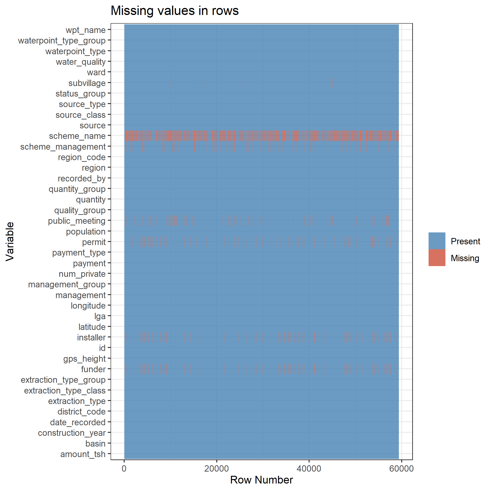

{width=250px, height=500px}
```{r setup, include=FALSE}
knitr::opts_chunk$set(echo = F, message = F)
```

```{r}
library(xgboost)
library(caret)
library(dplyr)
library(DiagrammeR)
library(tidyverse)
```

# Overview of this blog post

According to Water.org[1], Tanzania is experiencing a water and sanitation crisis. According to their records 4 million people lack access to safe water resources. People often spend a significant amount of time traveling long distances to collect water, and this burden often falls on women and girls. Using the data provided for the Pump it Up competition by DrivenData[2] along with Tanzania's 2012 census report[3] we will go through the machine learning approach using XGBoost to create a model that can predict whether a water well is functional, needs repair, or non-functional. In addition, we will explore the features that were used in the model. 

## Background

Earlier this year, DrivenData hosted an educational data science competition that requires a machine learning approach to identify water pump functionality in Tanzania. The data provided for the competition contains variables that focuses on the specific features of these water wells such as location of the well, construction year, record date, and quality of the water. Identifying the functionality of water wells in Tanzania is important in addressing the water crisis in Tanzania but there is a greater opportunity to explore additional factors that may show why a particular water shortage is occurring a given region of the country.

## What is the problem?

Tanzania is experiencing a water crisis where about 4 million people lack access to safe water resources. While there is data on both Tanzania’s water well quality and the 2012 census, there is no attempt to combine these resources to assess the overall water situation in the country. Solving the water crisis requires both a problem-specific approach (identifying functionality of the wells) and a broader analysis of how different regions in the country are affected. Although there is no clear cause and effect pattern, identifying which regions are doing well in relation to others may help develop preventative strategies for the future and can also shed light on the challenges that the citizens of this country are facing when trying to access safe drinking water.

## Why is it important to solve?

In 2016, Water.org found that Tanzania is eligible for what they call a “water credit solution” which allows for lending programs to households and water companies. My project attempts at providing practical guidelines in solving the water crisis by first addressing the functionality of the water wells in the country. Combining socioeconomic data into the analysis may also help answer questions such as how the water crisis is persistent for a given region. Examining the socioeconomic differences between regions may help get at issues like, which regions are experiencing water access and quality issues the most.

# The Data

## Outcome variable in the model

The dependent variable in the model is called status_group. This is a categorical variable that contains three classes: functional, functional needs repair (FNR), and non-functional. Since this is a categorical variable, a supervised machine learning classification approach will be used. The best model will be selected via the highest Cohen's kappa score.

Kappa is about how much better your model classifier is performing over the performance of a classifier that simply guesses at random according to the frequency of each class. Kappa takes on a range of values from -1 to 1.

According [Landis, J.R.; Koch, G.G. (1977). “The measurement of observer agreement for categorical data”. Biometrics 33 (1): 159–174], Kappa scores can be categorized as follows:  

* less than 0.20 (not good)

* 0.21 to 0.40 (fair)

* 0.41 to 0.60 (pretty good)

* 0.61 to 0.80 (great) 

* greater than 0.80 (almost perfect)

## What types of features were considered?

The features and their descriptions from the Pump it Up data can be found here:
[https://www.drivendata.org/competitions/7/pump-it-up-data-mining-the-water-table/page/25/]

The features from the Tanzania 2012 census are:  

* total_region_pop: total population for a given Tanzanian region  

* households_per_region: number of households by region  

* mhead_avg_household_size_per_region: average number of male head of household by region  

* fhead_avg_household_size_per_region: average number of female head of household by region  

* literacy_rate_by_region: percent of the literate population by region  

* pct_unemployed_by_region: percent of the unemployed population by region  

* region_area_sq_mi: area in square miles of a given region  

Before I get into the final model and results. I would like to briefly mention a few things about the data challenges encountered while wroking on this project.

## Dealing with missing data

Here is a plot of the missing data:

{width=150px, height=500px}

The data appears to not be missing at random because if we look at installer and funder variables, there is a 100% match in the rows where the data is missing. In addition, there were 4 regions in which all the observations had a zero value for amount_tsh variable. An imputation strategy is needed because we can not simply delete the rows where the data is missing because the data is not missing at random. I will not elaborate too much on this in this post, because it is a whole process of its own, but the code for this entire project can be found in my GitHub repo [https://github.com/nickkachanyuk?tab=repositories].

Looking at the missing values graph we can exclude variables like scheme_name, scheme_management, installer, and funder from further analysis. The wpt_name is a unique identifying name value for each observation and can also be excluded from the analysis.

## Target variable: class imbalance or unnecessary classes present? 

Class imbalance is an important topic to discuss when preparing data for predictive modeling. From the graph below we can see that the functional class is the most popular class in the target variable (status_group).

```{r, warning=FALSE}
tanzania <- read_csv('final_train.csv') %>% select(-X1)

tanzania$status_group <- as.factor(tanzania$status_group)
```

```{r}
set.seed(510)
indexes <- sample(1:nrow(tanzania), 0.75 * nrow(tanzania))
train_data <- tanzania[indexes,]
test_data <- tanzania[-indexes,]
```

```{r}
tanzania %>% group_by(status_group) %>% dplyr::summarize(well_count = n())
```

Class imbalance can be problematic for some classification problems because a model can become 'fixed' on the most frequent class and fail to learn as much about the less frequent classes thus decreasing the accuracy in the predictions. A solid strategy is to upscale a less frequent class by generating more observations that resemble that class.

Another possible approach is to collapse FNR class with either functional or non-functional category. This will result in only two factor levels for the target variable, decrease the gap in the class imbalance, and also impose a more general classification system. If a pump needs repair it is likely to become non-functional in the near future and I think it makes sense to have two classes that could be: functional pumps versus pumps that need to fixed. This becomes more evident as I discuss the final features and how well the three classes are distributed among them.

## Too many features and dimensionality reduction

The number of predictor variables originally present in the data set was 39 coming from "Pump it Up" data set and 9 additional variables were added from the 2012 Tanzanian census report for a total of 48 variables. That number quickly grew to 84 predictors after some of the categorical variables were converted to dummy variables to be used in the principal component analysis and machine learning algorithm.

Having a large number of predictors (features) is problematic because it can lead to overfitting where the noise of the data is picked up by the machine learning algorithm. This can cause bad out of sample (test) performance of the algorithm on new data. It is also more difficult to explain a model that has many features and dimensionality reduction techniques like PCA help make the data more concise. Later in this blog I will mention how the variables from the principal component analysis were created and what they represent.

# The model

For this project I chose to focus on the XGBoost model. The data has several outliers which XGBoost handles well. XGBoost is also good for large sized data sets that other models take longer to process and is less prone to overfitting thus making it notorious for good model performance.

On the other hand, XGBoost model is difficult to interpret when the tree plot has too many nodes (which was the case for my best performing model). It is also a bit more challenging to tune due to having many hyperparameters. 

## Hyperparameter tuning

XGBoost tree model has the following hyperparameters [https://www.hackerearth.com/practice/machine-learning/machine-learning-algorithms/beginners-tutorial-on-xgboost-parameter-tuning-r/tutorial/]:

I selected what seemed to be most appropriate hyperparameter range values based on the definitions of the hyperparameters and also using cross-validation during the model tuning.

Below are hyperparameter values of the best performing XGBoost model and also a visual representation of hyperparameter tune grid.

```{r}
load("xgb_model.Rdata")
```

```{r, results='hide'}
xgb_model
```

```{r}
xgb_results <- xgb_model$results %>% arrange(desc(Kappa))
```


```{r}
xgb_model$bestTune
```

```{r}
xgb_results2 <- xgb_results %>% select(c("eta", "max_depth", "colsample_bytree", "min_child_weight", "Kappa"))
```

```{r}
xgb_results2$max_depth <- as.factor(xgb_results2$max_depth)
levels(xgb_results2$max_depth) <- c("max_depth_2", "max_depth_4", "max_depth_6", "max_depth_8")

xgb_results2$colsample_bytree <- as.factor(xgb_results2$colsample_bytree)

ggplot(xgb_results2, aes(eta, Kappa)) + 
  geom_point(aes(color = colsample_bytree, alpha = 0.75)) +
  geom_jitter(aes(color = colsample_bytree)) + 
  facet_wrap(max_depth~.) + 
  theme_bw() + 
  labs(title = "XGBoost Hyperparameter Grid", caption = "gamma = c(0,5)\nmin_child_weight = 5") 
  
```

It seems classifiers with higher values of max_depth perform better than more shallow tree classifiers, and the lower to intermediate eta values are a good combination as well.

Next, let's examine the confusion matrix.

## Confusion matrix

```{r}
confusionMatrix(predict(xgb_model, test_data),factor(test_data$status_group))
```

The model classifies functional wells better than any other target class. It seems to struggle with classifying FNR wells and does a mediocre job at classifying non-functional wells. Collapsing FNR and non-functional class may seem like a good suggestion for further analysis considerations. 

The Kappa value of 0.599 shows that this is a good classifier after all and it seems like there is no apparent overfitting.

## Examining the improtance of features in the model and feature characterstics (distribution, suggestions, flaws, etc...)

### Feature importance

```{r}
library(vip)

vip(xgb_model, num_features = 12, geom = "col", aesthetics = list(fill = "bisque1", size = 0.5, color = "mistyrose3")) + theme_bw() + xlab(label = "Feature name")
```

The top four most important variables in the model are all feature engineered variables that were created via PCA (principal component analysis). This is probably because they contain a good proportion of the variance in the data. Surprisingly the original categorical variable "permit" is the least predictive even though one might believe that wells that have a permit are more likely to be functional because they have undergone more inspection and compliance.

Let's examine each variable more closely now.

### Amount tsh variable

```{r}
tanzania %>% ggplot(., aes(amount_tsh)) + geom_boxplot(aes(fill = status_group)) + facet_grid(status_group ~.) + theme_bw() + 
  scale_y_discrete(labels = NULL, breaks = NULL) + labs(x = "amount tsh")
```

The variable amount_tsh is the original variable in the Tanzania water well data. The description of this variable reads "total static head (amount water available to waterpoint)" with no units of measurement specified. Either this variable can be dropped for a decrease in variance but hopefully improving the accuracy after using a new model.  

Examining the box plot shows that it is a reasonable variable to use after-all though. If we keep the outliers, which XGBoost handles well, they can be used to show the difference between the three target groups. It adds up, functional wells will indeed have more water available to waterpoint than any other two categories. Once again though, the argument for collapsing functional needs repair class and non functional class maybe a purposeful suggestion to try out in future analysis.

### Literacy rate by region variable

```{r}
tanzania %>% ggplot(., aes(literacy_rate_by_region)) + geom_boxplot(aes(fill = status_group)) + facet_grid(status_group ~.) + theme_bw() +
  scale_y_discrete(labels = NULL, breaks = NULL) + labs(x = "literacy rate by region")
```

According to the VIP plot, literacy rate by region is in 9/12th position for importance which is also evident by how the IQR ranges overlap for each target category. Once again collapsing FNR(functional needs repair) with non functional is recommended as an avenue to explore.

### Perecent unemployed by region

```{r}
tanzania %>% ggplot(., aes(pct_unemployed_by_region)) + geom_boxplot(aes(fill = status_group)) + facet_grid(status_group ~.) + theme_bw() +
  scale_y_discrete(labels = NULL, breaks = NULL) + labs(x = "% unemployed by region")
```

According to VIP plot, this variable is 10/12th place for importance. There also seems to be a pattern for how importance is measured. Reading ["https://cran.r-project.org/web/packages/vip/vignettes/vip-introduction.pdf"]: 

"For classification problems, an area under the ROC curve (AUC) statistic can be used to quantify predictor importance.
The AUC statistic is computed by using the predictor x as input to the ROC curve. If x can reasonably
separate the classes of Y, that is a clear indicator that x is an important predictor (in terms of class
separation) and this is captured in the corresponding AUC statistic."

The target variable does not separate well in this predictor. This variable could be further dropped from analysis which may improve the accuracy of the model.

### Well strain variable

```{r}
tanzania %>% ggplot(., aes(well_strain)) + geom_boxplot(aes(fill = status_group)) + facet_grid(status_group ~.) + theme_bw() +
  scale_y_discrete(labels = NULL, breaks = NULL) + labs(x = "well strain")
```

This variable is 6/12th position on importance plot. Well strain is a variable that was feature engineered using the following formula:

$$wellstrain = ((population/totalregionpop) * regionpopdensity)$$  

* where population is the number of people living around the well  

* total_region_pop is the total number of people living in a given region of Tanzania  

* region_pop_density is total_region_pop/region_area_sq_mi

I wonder if there is any difference in the IQR ranges of the well strain variable between the different status groups?

```{r}
tanzania %>% select(c(status_group, well_strain)) %>% group_by(status_group) %>% summarise(iqr = IQR(well_strain))
```

100% overlap between functional and non functional groups.

### Permit variable de-dummified

{width=150px, height=500px}

From the density plot we can see that the permit variable distribution does not separate well between the target classes and probably the reason behind the dummy versions scoring 11th and last place on the variable importance graph.

### Handpump groundwater shallow well principal component variable

Handpump_groundwater_shallow_well is a feature engineered variable that was created via PCA. The distribution of the target variable classes within this variable is shown below.

```{r}
tanzania %>% ggplot(., aes(handpump_groundwater_shallow_wells)) + geom_density(aes(fill = status_group)) + facet_grid(status_group ~.) + theme_bw() + labs(x = "handpump groundwater shallow wells principal component")
```

The density plot shows that there isn't much separation of the target variable classes within this principal component but the distributions are not exact matches. This variable is the 4th most important variable according to the variable importance plot yet it seems to show similar distribution patterns of the target variable in the same way the other less important features are doing. One explanation for this is that since this is a principal component variable, it captures more variance in the data than a regular variable would.  

Let's briefly explore how this variable was created via PCA.

#### PCA process

A collection of variables that described the characteristics of the well such as construction year, extraction type (handpump, motorpump, gravity, etc), water quality and quantity produced by the well, and other features were used in PCA. 

In PCA, a principal component is a linear combination of variables. Much like in linear regression, how well a variable "fits" to a principal component is dictated by coefficients called factor loadings. These factor loadings do not have a restrictive range of -1 to 1 like in regression. Despite this difference a factor loading essentially signifies a similar concept; the magnitude of the factor loading shows how strong a given observation fits to a principal component. Larger values show stronger correlations and the sign dictates the direction of the correlation. Based on these loadings we can characterize what a principal component is about.  

Below is a dataframe that shows this:

```{r}
load("pca_chara_df.Rda")

pca_chara_df
```

We can see that the variables extraction_type_class_handpump, source_class_groundwater, and source_type_shallow well have the largest positive values for principal component 1. Here it makes sense to rename this principal component to something like handpump_groundwater_shallow_wells principal component. Looking at the density plot above we can see how the observations(rows) of the data are distributed for this principal component and also how the target variable classes are distributed. It seems that functional and FNR wells are distributed towards more negative loading values (with some exceptions) indicating that these wells usually do not rely on handpump extraction methods from shallow wells. Whereas non-functional wells seem to be distributed towards more positive loading values indicating that these wells tend to rely on handpump extraction from shallow and/or groundwater wells.

### Other extraction from rivers and lakes principal component variable

Other_extraction_from_rivers_lakes is another feature engineered variable that was created via PCA. The distribution of the target variable classes within this variable is shown below.

```{r}
tanzania %>% ggplot(., aes(other_extraction_from_rivers_lakes)) + geom_density(aes(fill = status_group)) + facet_grid(status_group ~.) + theme_bw() + labs(x = "other extraction from rivers and lakes principal component")
```

This principal component was created using the same variables and process used to create the handpump groundwater shallow well principal component variable.

Again there is not much separation in the distribution of the status group classes. It seems that functional wells are more likely to be negatively correlated with this principal component than FNR and non-functional wells. 

The table below again shows how this principal component (PC2) was conceptualized.

```{r}
load("pca_chara_df.Rda")

pca_chara_df
```

Interestingly enough this variable is the most important variable in the XGBoost model.

### Densely populated wells principal component variable

This is another feature engineered variable created from PCA. The data frame below shows which variables were used in this PCA; these variables were about certain demographics of the regions in Tanzania such as the population around the well, total region population, number of households per region, and region population density.

```{r}
load("pca_demo_df.Rda")

pca_demo_df
```

The dense populated wells is represented as PC1 in the table above. Let's examine how the target variable is distributed for this variable.

```{r}
tanzania %>% ggplot(., aes(dense_populated_wells)) + geom_density(aes(fill = status_group)) + facet_grid(status_group ~.) + theme_bw() + labs(x = "densely populated wells principal component")
```

A lot of overlap for this variable and is probably the reason why it placed 7/12 on the variable importance graph. Interestingly enough functional wells tend to be located in more dense populated areas than FNR and non-functional wells although this difference is not too great. In my opinion, it may be possible to complete further studies without this variable being included.

### Sparsely populated wells principal component variable 

This is another feature engineered variable created from PCA. The same variables used in creating the densely populated wells variable were also used for this variable. In the table below this variable is labeled as PC2.

```{r}
load("pca_demo_df.Rda")

pca_demo_df
```

```{r}
tanzania %>% ggplot(., aes(sparsely_pop_wells)) + geom_density(aes(fill = status_group)) + facet_grid(status_group ~.) + theme_bw() + labs(x = "sparsely populated wells principal component")
```

Once again there is a lot of overlap between the different target classes in the distribution for this variable. It seems that to some degree the non-functional wells tend to have slightly more sparsely populated wells than functional and FNR wells.

It is also no surprise that this variable placed 8/12 on variable of importance plot which suggests that this variable can possibly be removed from further analysis in the future.

### Medium to large sized, southern and eastern regions principal component variable 

Another feature engineered variable via PCA. This variable was created using geographic predictors such as altitude (gps_height), longitude, latitude, region name, and basin location. Below is the data frame used to conceptualize this variable.

```{r}
load("pca_geo_df.Rda")

pca_geo_df
```

Looking at PC1 we can see that the variables that take on large and positive values are longitude and region area in square miles, and large negative value is shown for latitude. According to [https://journeynorth.org/tm/LongitudeIntro.html], positive longitudinal values indicate more eastern locations and negative latitudinal values indicate more southern locations.

Let's look at the target variable distribution for this variable.

```{r}
tanzania %>% ggplot(., aes(med_lg_SE_region)) + geom_density(aes(fill = status_group)) + facet_grid(status_group ~.) + theme_bw() + labs(x = "medium to large sized, southern and eastern regions principal component")
```

Not much separation is happening here either but looking at the functional group peaks we can see that functional wells tend to be clustered in more southern and eastern regions of Tanzania. This variable is the second most important variable in the variable of importance plot.

### Small to medium sized, northern and western regions principal componenet variable

This is the last variable we will examine that was used in the XGBoost model. This variable was also feature engineered using the same geographic variables in PCA, and is shown as PC2 in the data frame below. 

```{r}
load("pca_geo_df.Rda")

pca_geo_df
```

Negative longitudinal values indicate that this principal component is more about the western regions of Tanzania. The latitudinal values are slightly less negative values than in PC1 which indicates that that PC2 is more about northern regions of Tanzania. Also, region area value is also slightly less positive than PC1, indicating that the regions that load well onto PC2 are small to medium sized. 

Let's look at the target variable distribution for this variable.

```{r}
tanzania %>% ggplot(., aes(small_med_NW_regions)) + geom_density(aes(fill = status_group)) + facet_grid(status_group ~.) + theme_bw() + labs(x = "small to medium sized, northern and western regions principal component")
```

The FNR wells seem to be mostly clustered in the northern and western regions of Tanzania. Looking at the functional well group, we can see the two tails on the negative x-axis further support the idea that functional wells tend to be located in southern and eastern regions of Tanzania rather than in the north and/or west.

Overall this variable is placed third in the variable of importance plot.

# Conclusion
	
Using XGBoost tree model, an algorithm that predicts the status of the well was created. The Kappa score for the test set was 0.599 indicating that XGBoost did a solid job in determining which wells were functional, needed repairs, or non-functional. 

The trained model includes 12 predictors. After exploring the predictors via data visualizations, there seems to be evidence that the 6 least important variables in the importance plot may be removed for future projects dealing with this data. The 6 least important variables are:  

* dense_populated_wells  

* sparsely_populated_wells  

* literacy_rate_by_region  

* pct_unemployed_by_region  

* permit_yes  

* permit_unknown

Looking at the 6 remaining predictors, the following conclusions can be made:  

* Functional and functional need repair wells usually do not rely on handpump extraction methods and/or these wells are usually not shallow wells.

* Functional wells tend to use "other" extraction methods and/or the water source for these wells comes from either rivers or lakes.

* Functional wells tend to have more people living around these wells.

* Non-functional wells tend to have less people living around these wells.

* In general, functional wells are more present in the southern and/or eastern parts of Tanzania.

* Functional need repair wells are more common in the northern and/or western parts of Tanzania, and non-functional wells also follow this pattern but to a lesser degree.
	
### How can these findings be used in the real-world

This project attempts to create an initial framework for dealing with water-shortage issues in Tanzania. One intervention strategy that may be useful is to continue monitoring the amount of water present at a given well (amount_tsh variable). For this variable to be useful in future predictions, the units of measurement would first need to be defined so that there are no errors during data collection. In addition, a threshold value would need to be set that can serve as indicator if a well is at risk for being non-functional. According to the data visualization for this variable, this threshold boundary is located somewhere among the outlier values for the amount_tsh variable.

Well strain is also a measurement variable that can indicate functionality of a given well. The data visualization of this variable shows that non-functional wells have larger outliers for this variable than functional and FNR wells.

Finally indicator variables created by PCA can help highlight the geographic and demographic differences that may exist between the three classes of wells, and characteristics of a given well are also useful indicators. Unfortunately due to missing data issues, it was difficult to address the differences between regions of Tanzania. This was because four regions of Tanzania had no observations for variables like amount_tsh. If addressing water quality by region is desired, then more accurate data collection is needed and is something that could be done for further analysis. 

## Future project direction

The following is a list of possible things to explore in the future for this project:  

* Convert this from a multiclass to a binary classification problem to address class imbalance and lack of variance between FNR and non-functional classes.

* Address the water well functionality by regions. This requires for the data to be recollected (at least for the four regions where data is missing). The four regions are: Dodoma, Kagera, Mbeya, and Tabor

* Try a new model that includes only the top 6 predictors in the variable of importance plot.